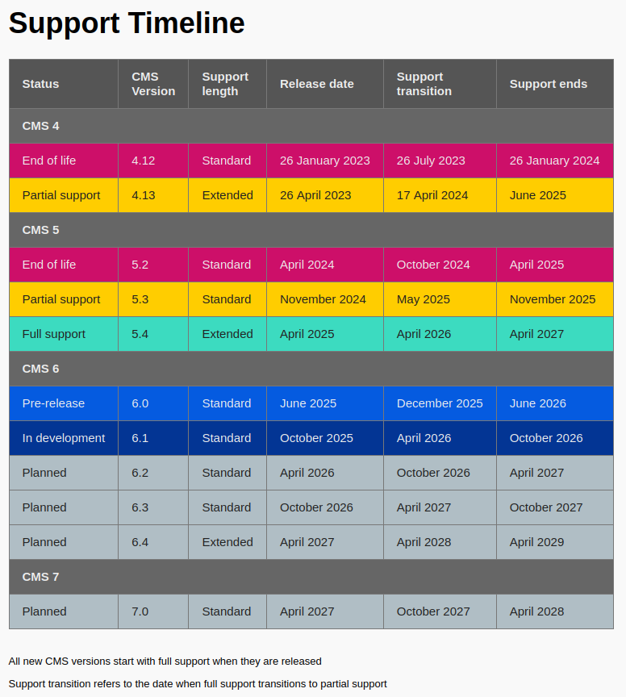

An updated table for the support-timeline

Updates dynamically

JSON data is intended to be hosted from a different location from where the table is displayed.

Use a basic webserver run - these is needed some that the `fetch()` request to get data.json isn't blocked by CORS

```bash
python3 -m http.server 8000
```

Dates for data.json must be in ISO-8601 format, though can omit the day portion


